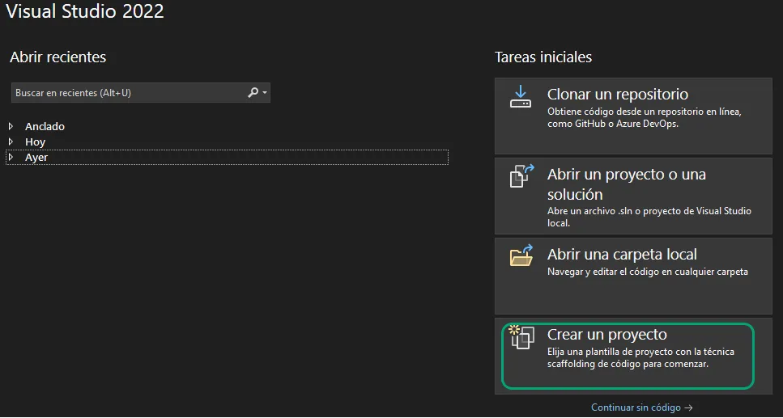
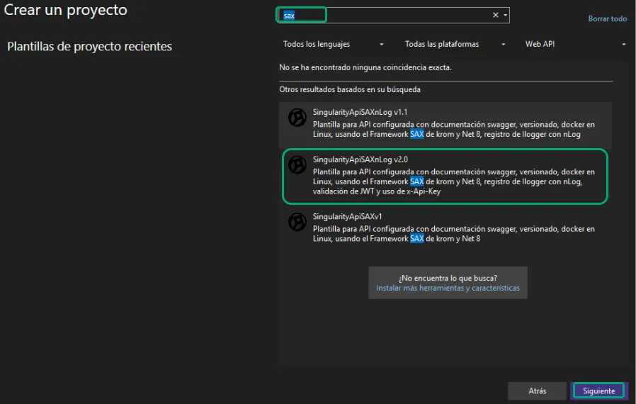
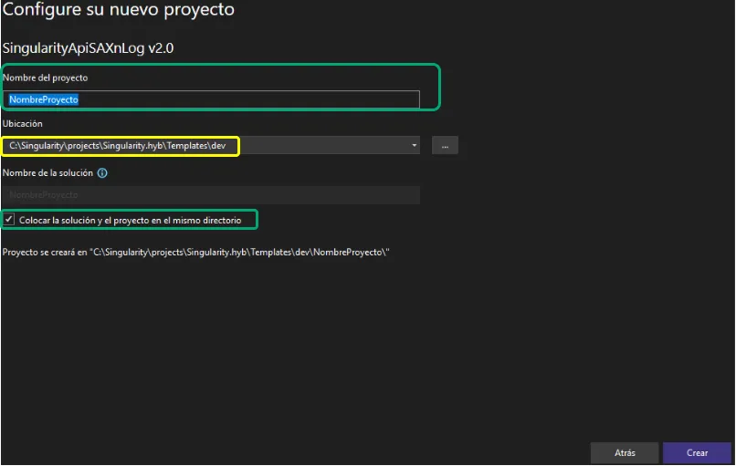

# 📦 Plantilla(s) de proyecto API para Visual Studio 2022, sistema singularity

Esta sección del repositorio contiene una **plantillas personalizada de Api para Singularity** para usar en Visual Studio 2022. Sigue los pasos a continuación para instalarla y comenzar a utilizarla desde la interfaz de **"Crear nuevo proyecto"**.

---

## 🧰 Requisitos

- Visual Studio 2022 instalado ([Descargar aquí](https://visualstudio.microsoft.com/es/vs/))
- clonado o descargado una plantilla(s) de las disponibles como  `.zip`
- Acceso al directorio de plantillas de Visual Studio
- haber clonado el repositorio del tinySax

---
## 🚀 Instrucciones para importar y usar la plantilla

### 1. Copiar la plantilla al directorio de plantillas de Visual Studio
Visual Studio busca las plantillas en una carpeta específica del usuario. Debes copiar la carpeta de la plantilla al siguiente directorio:

```bash
C:\Users\<TU_USUARIO>\Documents\Visual Studio 2022\Templates\ProjectTemplates
```

### 📁 Estructura esperada:
```bash
Documents
└── Visual Studio 2022
    └── Templates
        └── ProjectTemplates
            └── NombreDePlantilla.zip (contenido descomprimido)
```

### 2. Abrir Visual Studio 2022
Lanza Visual Studio y selecciona "Crear un nuevo proyecto".



### 3. Buscar la plantilla instalada
En el buscador de plantillas, escribe el nombre de tu plantilla personalizada. Debería aparecer en los resultados.

Selecciona la plantilla, haz clic en "Siguiente", y continúa con la configuración normal del proyecto.




### 4. Configure el nombre del proyecto
Establesca el nombre de su proyecto, **importan** revisar la ruta tenga esa estructura de carpetas donde se va a crear, seleccionar Colocar la solucion y el proyecto en el mismo directorio.


### 📁 Estructura esperada:
```bash
Singularity/
└──projects/
    └── singularity.hyb/
        └── nombremodulo/          <-- Módulo específico (nombre variable)
            └── dev/               <-- Carpeta de desarrollo del módulo
                └── api/           <-- API backend usando la plantilla con el tinySax  (**Nombre del proyecto)
```

**Nota:** Si se crea el directorio con el nombre del proyecto es preferible se renombre el directorio, al nombre estandar llamado  **api**
